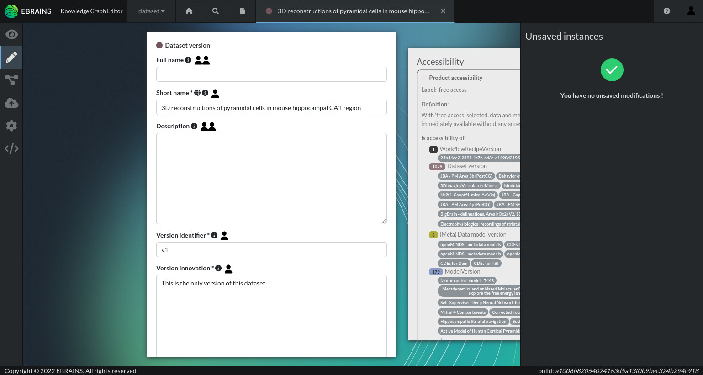

# KG Editor

*Use the KG Query Builder to design your own queries on the EBRAINS Knowledge Graph*

### Edit, suggest, detect conflicts, assure quality, publish, standardize and extend metadata

It is a lot of work to get the metadata right. The KG Editor is a critical component of the metadata management system which makes sure that the ingestion and management of the metadata on the graph database is easy to do and can be 
handled by the domain-specific experts without requiring programming skills. It is used by the EBRAINS curation team as well as data-providers to submit data to EBRAINS.

#### Features
- Dashboard with user-specific notifications, short-cuts and tips for more productive work
- Search by data structure including release-status indication
- "Review" mode (read-only)
- Creation of new instances
- Edit mode with suggestion lists, in-line linking between instances, visualization of conflicts between users / systems.
- Bulk-save including diff
- Graph visualization for navigation and exploration
- Releasing / publication workflow screen
- Deletion / duplication of resources
- Invitation of reviewers